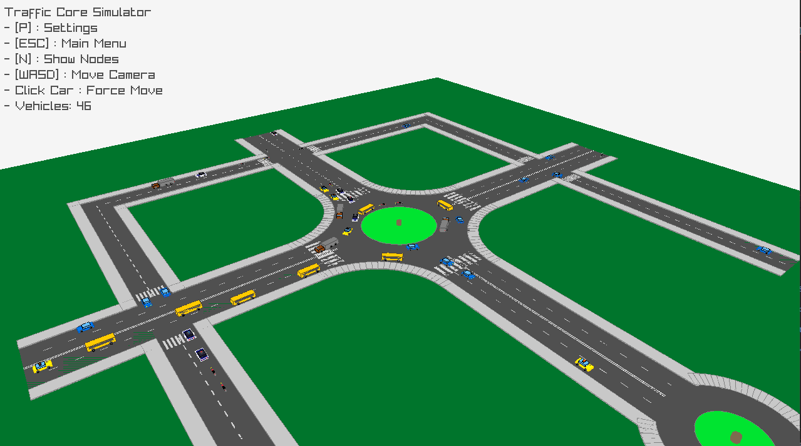
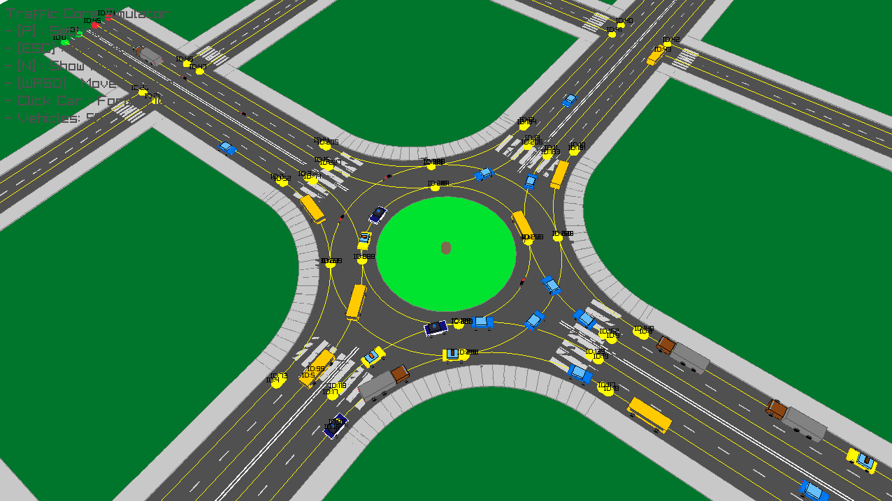
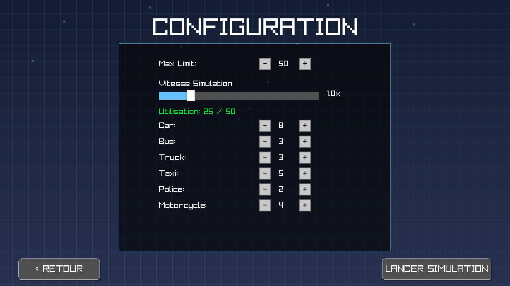

# 🚦 TrafficCore Simulator (v2.2):


**TrafficCore** is a high-performance 3D urban traffic simulation engine built from scratch using C++ and Raylib. It features a dynamic graph-based road network, intelligent vehicle AI, and a real-time configuration interface.

> **Current Version:** 2.2



---

## ✨ Key Features

### 🚗 Intelligent Traffic AI
- **Collision Avoidance:** Raycasting-based detection system to prevent vehicle accidents.
- **Lane Logic:** Vehicles detect lanes, maintain safe distances, and regulate speed based on flow.
- **Pathfinding:** Dynamic decision-making at intersections and nodes.

### 🏙️ Diverse Vehicle Types
A wide range of vehicle classes with unique behaviors and physics:
- **Civilian:** Cars, Buses, Trucks.
- **Service:** Taxis (with roof lights), Police Cars (with active sirens).
- **Two-Wheelers:** Motorcycles with tilt mechanics.



### 🛠️ Dynamic Engine
- **Graph-Based Roads:** Supports complex intersections, curved paths, and decision points.
- **Interactive UI:**
  - **Main Menu:** Animated backgrounds with smooth transitions.
  - **Settings:** Configure max vehicle count, spawn rates, and simulation speed in real-time.
  - **HUD:** Live statistics overlay.



- **Free-Roaming Camera:** Inspect the simulation from any angle in 3D space.

---

## 🛠️ Tech Stack

* **Language:** C++ (Standard C++14)
* **Graphics & Input:** [Raylib 5.0.0](https://www.raylib.com/)
* **Build System:** GNU Make
* **Math:** Raymath (Vector/Matrix operations)

---

## 📋 Prerequisites

Before building the project, ensure you have the following installed:

1.  **C++ Compiler**: `g++` (MinGW for Windows, GCC for Linux/macOS).
2.  **Make**: GNU Make tool.
3.  **Raylib**: The project requires the Raylib library.
    * *Default Path (Windows)*: `C:/raylib/raylib`
    * *Default Path (Linux)*: Standard system include paths or update `Makefile`.

---

## 📂 Project Structure

```text
TrafficCore/
├── include/                     # Header files (Declarations)
│   ├── app.h                      # Main application wrapper & lifecycle
│   ├── basicmap.h                 # Static map geometry and rendering
│   ├── config.h                   # Global configuration & constants
│   ├── draw_utils.h               # Helper functions for 3D drawing
│   ├── ingame_menu.h              # Logic for the pause/settings menu
│   ├── interface_new.h            # Main UI & HUD system
│   ├── roadgraph.h                # Graph logic (nodes/edges) for pathfinding
│   ├── simulation.h               # Core simulation loop & state
│   ├── spawner.h                  # Vehicle generation logic
│   ├── traffic_manager.h          # Global traffic flow control
│   └── vehicle.h                  # Vehicle physics, AI & collision logic
│
├── src/                         # Source files (Implementations)
│   ├── main.cpp                   # Entry point
│   ├── app.cpp                    # Application setup and loop handling
│   ├── basicmap.cpp               # Map visualization logic
│   ├── config.cpp                 # Config loader
│   ├── draw_utils.cpp             # Rendering helpers
│   ├── ingame_menu.cpp            # Menu interactivity implementation
│   ├── interface_new.cpp          # UI rendering implementation
│   ├── roadgraph.cpp              # Road network calculations
│   ├── simulation.cpp             # Main simulation engine logic
│   ├── spawner.cpp                # Vehicle spawning algorithms
│   ├── traffic_manager.cpp        # Traffic rules & coordination
│   └── vehicle.cpp                # Vehicle behavior implementation
│
├── screenshots/                 # Project visual showcase
│   ├── hero_shot.png
│   ├── ui_settings.png
│   └── vehicles_closeup.png
│
├── tests/                       # Testing suite
│   └── unit_tests.cpp             # Unit tests for core components
│
├── Makefile                     # Build instructions
└── README.md                    # Project documentation